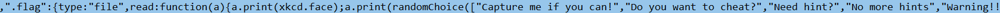
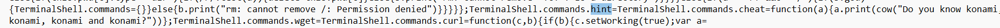
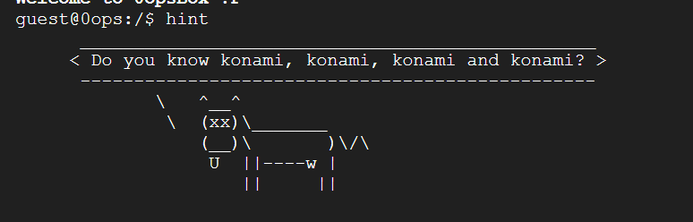
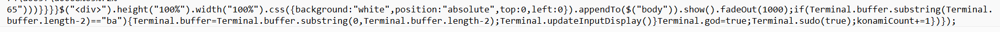
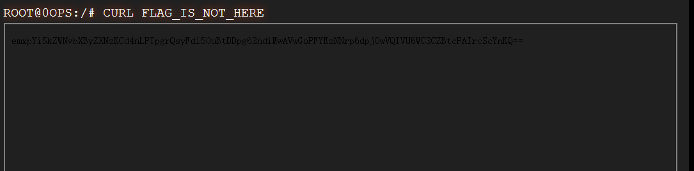

开始在官网鼓捣了一会没有发现什么有用的信息(hhh)

然后开始翻html、css、js源码(好多好长)

然后在0ops_cli_all.js中发现了有用信息(虽然js脚本不怎么看得懂、但是可以大致猜到意思的)

然后发现了几个关键点



这里的意思是读取.flag这个文件的时候会有以下输出(后面发现在sudo ls 命令下也可以查到.flag的文件)

然后又发现一个比较关键的东西hint



在官网输入hint会显示



这里还不是对konami很了解(问就是游戏王、魂斗罗这些游戏玩少了)

然后搜了一下konami的大致信息后来又看js代码



发现有一个konami.count和ba发现好奇怪，后面搜索konami的特殊代码后面知晓要输入一个特殊代码

就是
$$
\uparrow \uparrow \downarrow\downarrow\leftarrow\rightarrow\leftarrow\rightarrow ba
$$
输入页面会有变化，最后输入四次后会出现如下



然后得到一串base64编码后的字符就很痛苦不知道怎么解码

用网站解码发现格式错误好多(还是要多用python本身解码)

```python
import zlib
import base64

base64_str = 'emxpYi5kZWNvbXByZXNzKCd4nLPTpgrQsyFdi50uBtDDpg63ndiMwAVwGoPFYEzNNrp6dpjOwVQIVU6WC3CZBtcPAIrcScYnKQ=='
raw_data = base64.b64decode(base64_str)
encode_flag=b'x\x9c\xb3\xd3\xa6\n\xd0\xb3!]\x8b\x9d.\x06\xd0\xc3\xa6\x0e\xb7\x9d\xd8\x8c\xc0\x05p\x1a\x83\xc5`L\xcd6\xbazv\x98\xce\xc1T\x08UN\x96\x0bp\x99\x06\xd7\x0f\x00\x8a\xdcI\xc6'
flag=zlib.decompress(encode_flag)
print(flag)
```

解码后得到如下

b'>++++++++++++++++++++++++++++++++++++++++++++++++++++++++++++++++++++++.<+++++++++++++++++++++++++++++++++++++++++++++++++.>------------------.+++++++++++++++++++.++++++++++++++++++++++++.<.>------------------------------------------.++++++++++++++++++++++++++++++++++++++++++.-----------------.<-.>++++++.+++++++++++.-----------------------.---------------------.+++++++++++++++++++++++++++++++.-------------------------------.'

一眼brainfuck

解码后得到flag