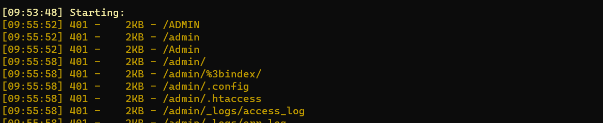
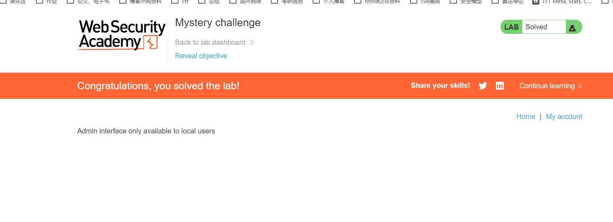

这里是用host来认证是否为内网

先用dirsearch 扫一下



扫到admin

然后进去admin



发现没有权限，然后这里是用host来进行认证的，于是修改host为localhost而不是127.0.0.1这里的一个区别如下

```
127.0.0.1 is normally the IP address assigned to the "loopback" or local-only interface. This is a "fake" network adapter that can only communicate within the same host. It's often used when you want a network-capable application to only serve clients on the same host. A process that is listening on 127.0.0.1 for connections will only receive local connections on that socket.

"localhost" is normally the hostname for the 127.0.0.1 IP address. It's usually set in /etc/hosts (or the Windows equivalent named "hosts" usually at C:\Windows\System32\Drivers\etc\hosts). You can use it just like any other hostname - try ping localhost to see how it resolves to 127.0.0.1.

0.0.0.0 has a couple of different meanings, but in this context, when a server is told to listen on 0.0.0.0 that means "listen on every available network interface". The loopback adapter with IP address 127.0.0.1 from the perspective of the server process looks just like any other network adapter on the machine, so a server told to listen on 0.0.0.0 will accept connections on that interface too.

That hopefully answers the IP side of your question. I'm not familiar with Jekyll or Vagrant, but I'm guessing that your port forwarding 8080 => 4000 is somehow bound to a particular network adapter, so it isn't in the path when you connect locally to 127.0.0.1
```

