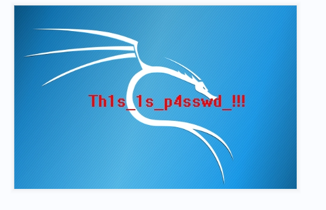
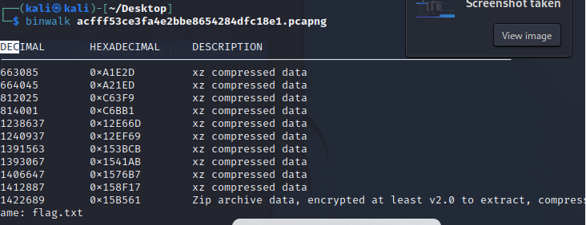

用wireshark打开流量包分析

发现大概是一个hacker用菜刀连接获取权限

追踪http数据流可以发现其上传图片6666.jpg的数据

用hex复制其数据到010editor里面，然后以JPG保存即可获得图片，FFD8FF 到 FFD9 是 JPEG 图像文件的起始和结束标记。

即可获取图片内容

然后再用binwalk分析数据包

发现一个zip文件

这里用foremost分离即可获得压缩包，然后输入密码获取flag