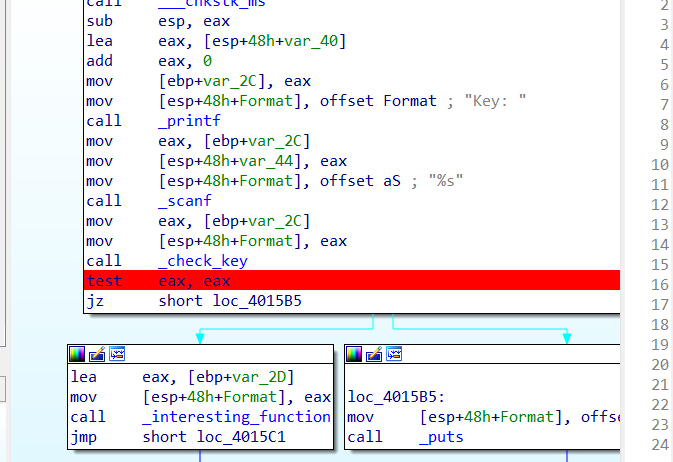
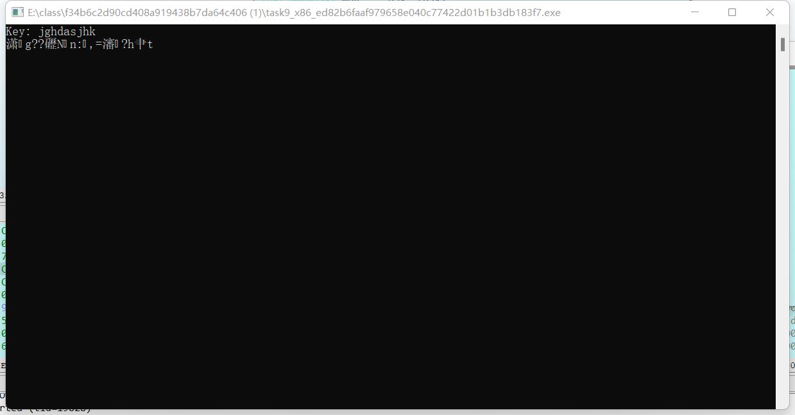

先下载附件解压缩发现里面有三个文件（两个linux和一个windows上的）

用windows的IDA分析exe

main函数大概如下：

```c
  v27 = 0x65;
  v26 = 0x32;
  v25 = 0x2D;
  v24 = 0xE3;
  v23 = 0xD3;
  v22 = 0x43;
  v21 = 0x92;
  v20 = 0xA9;
  v19 = 0x9D;
  v18 = 0xD2;
  v17 = 0xE6;
  v16 = 0x6D;
  v15 = 0x2C;
  v14 = 0xD3;
  v13 = 0xB6;
  v12 = 0xBD;
  v11 = 0xFE;
  v10 = 0x6A;
  v9 = 0x13;
  v3 = alloca(0x20);
  v4 = alloca(0x20);
  v8 = &v6;
  printf("Key: ");
  scanf("%s", v8);
  if ( check_key(v8) )
    interesting_function(&v7);
  else
    puts("Wrong");
  return 0;
}
```

发现就大概输入key然后检查key，就可以去分析汇编代码了



可以找到跳转的指令发现是在这里判断eax的值（为0就跳转）

F2在test这一行处设置断点 然后执行在这一行，在右边修改寄存器eax的值为1即可后来发现输出乱码



放弃选择在linux下用gdb调试

这步骤如下

```shell
经过 IDA 的分析，在主函数打断点，因为 check_key 函数打断点会进入，所以在主函数一直单步调试
1. b main
2. r
3. n (一直单步调试到输入 Key) //可以狂按enter
4. set $eax=1 (设置判断条件为真，运行到 test eax, eax)
5. c
flag_is_you_know_cracking!!!
```


