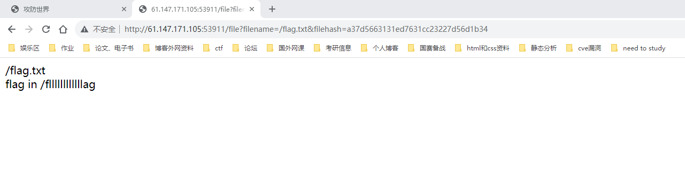

大概是一个tornado的模板注入（这里也看了下答案）

先看/flag.txt告诉你目标文件

主要的关键感觉就在于

http://61.147.171.105:53911/error?msg=这里会对模型进行一个渲染（挺amazing的）

输入这个http://61.147.171.105:53911/error?msg={{handler.settings}}即可获得secret的值，即可进行加密获取flag对应的hash值（如果没这么简单的话感觉可能要想办法读源码）