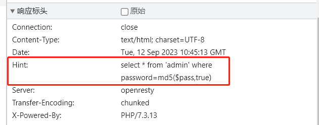

随便提交然后发现响应标头里面有hint



然后发现password=md5($pass,true)这里其实想了一下传进去的参数是password还是pass

其实前面应该是有一句话的

```php
$pass=$_GET('password')
```

然后发现

```php
content: ffifdyop
hex: 276f722736c95d99e921722cf9ed621c
raw: 'or'6\xc9]\x99\xe9!r,\xf9\xedb\x1c
string: 'or'6]!r,b
```

这里32位的16进制的字符串，两个一组就是上面的16位二进制的字符串。比如27，这是16进制的，先要转化为10进制的，就是39，39在ASC码表里面就是’    '    ‘字符。6f就是对应‘    o    ’。

       然后我们得到的sql语句就是 SELECT * FROM admin WHERE username = 'admin' and password = ''or'6�]��!r,��b'
    
       为什么password = ''or'6�]��!r,��b'的返回值会是true呢，因为or后面的单引号里面的字符串（6�]��!r,��b），是数字开头的。当然不能以0开头。（我不知道在数据库里面查询的时候，�这种会不会显示）
    
       这里引用一篇文章，连接在下面，里面的原话“a string starting with a 1 is cast as an integer when used as a boolean.“
    
      在mysql里面，在用作布尔型判断时，以1开头的字符串会被当做整型数。要注意的是这种情况是必须要有单引号括起来的，比如password=‘xxx’ or ‘1xxxxxxxxx’，那么就相当于password=‘xxx’ or 1  ，也就相当于password=‘xxx’ or true，所以返回值就是true。当然在我后来测试中发现，不只是1开头，只要是数字开头都是可以的。
    
       当然如果只有数字的话，就不需要单引号，比如password=‘xxx’ or 1，那么返回值也是true。（xxx指代任意字符）
