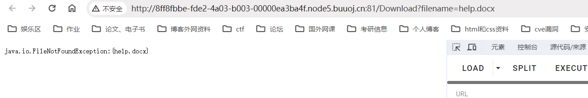
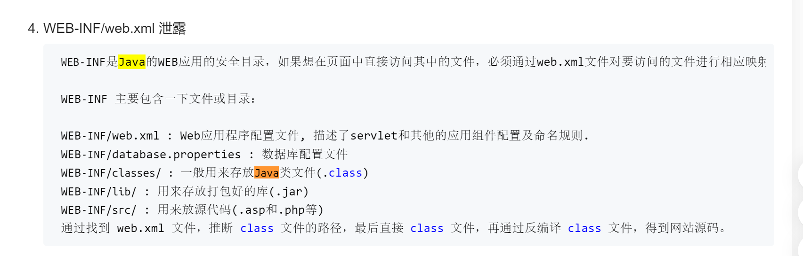
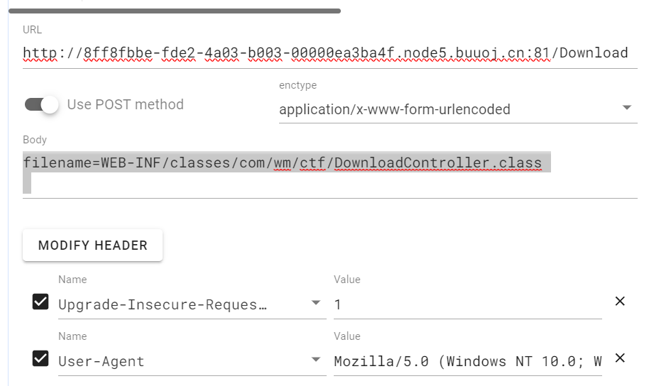

感觉算是比较简单的一道题了，但是自己太困了就懒得动脑子了，还是在给自己找借口

help处发现任意文件下载



然后改为POST就可以下载了，这里好玄学

然后发现Java的信息泄露都是这个



然后下载下来WEB-INF/web.xml然后得到如下

```xml
<web-app xmlns="http://xmlns.jcp.org/xml/ns/javaee" xmlns:xsi="http://www.w3.org/2001/XMLSchema-instance" xsi:schemaLocation="http://xmlns.jcp.org/xml/ns/javaee http://xmlns.jcp.org/xml/ns/javaee/web-app_4_0.xsd" version="4.0">
<welcome-file-list>
<welcome-file>Index</welcome-file>
</welcome-file-list>
<servlet>
<servlet-name>IndexController</servlet-name>
<servlet-class>com.wm.ctf.IndexController</servlet-class>
</servlet>
<servlet-mapping>
<servlet-name>IndexController</servlet-name>
<url-pattern>/Index</url-pattern>
</servlet-mapping>
<servlet>
<servlet-name>LoginController</servlet-name>
<servlet-class>com.wm.ctf.LoginController</servlet-class>
</servlet>
<servlet-mapping>
<servlet-name>LoginController</servlet-name>
<url-pattern>/Login</url-pattern>
</servlet-mapping>
<servlet>
<servlet-name>DownloadController</servlet-name>
<servlet-class>com.wm.ctf.DownloadController</servlet-class>
</servlet>
<servlet-mapping>
<servlet-name>DownloadController</servlet-name>
<url-pattern>/Download</url-pattern>
</servlet-mapping>
<servlet>
<servlet-name>FlagController</servlet-name>
<servlet-class>com.wm.ctf.FlagController</servlet-class>
</servlet>
<servlet-mapping>
<servlet-name>FlagController</servlet-name>
<url-pattern>/Flag</url-pattern>
</servlet-mapping>
</web-app>
```

然后看到com.wm.ctf.FlagController

把class下载下来即可看到



然后补充一点知识

8.2.3、<servlet-mapping>

<servlet-name>：Servlet的名字，唯一性和一致性，与元素中声明的名字一致。
<url-pattern：指定相对于Servlet的URL的路径。该路径相对于web应用程序上下文的根路径。将URL模式映射到某个Servlet，即该Servlet处理的URL。

8.2.4、加载Servlet的过程

容器的Context对象对请求路径(URL)做出处理，去掉请求URL的上下文路径后，按路径映射规则和Servlet映射路径（）做匹配，如果匹配成功，则调用这个Servlet处理请求。

