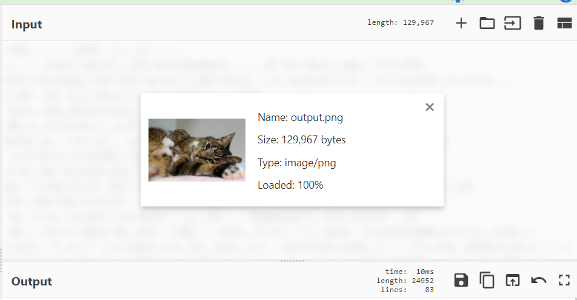

啊啊啊流量分析好难

先打开大致扫一下发现从ftp改为了smtp？可能会安全一点吗

搜索imf发现一下四条


第一个的文本内容为

```
'
Hi CryptoCat,

It's been a long time since we last saw each other, and I've been thinking about our friendship. I believe it's important for us to stay connected and share important things in a way that only you and I can understand.

I wanted to remind you that we need to pay more attention to our communications, especially when it comes to discussing crucial matters. Sometimes, we might need to hide our messages in plain sight, using our own secret language. As you know SMTP isn't secure as you think!

It's like we're on a treasure hunt, and the treasure is our bond. You know the drill - for our important stuff, we'll need to hide it somewhere unique, somewhere only we can find it.

Looking forward to hearing from you soon. Let's make our conversations more interesting and secure.

Best,
0xM4hm0ud
```

第二个为

```
Hey 0xM4hm0ud,

It's great to hear from you! I completely agree that we should keep our conversations private and intriguing. Our special bond deserves nothing less. I'm up for the challenge!

I've been thinking about a unique way we can communicate securely. 
Maybe we could use a combination of our favorite books, movies or pets as a code, or even a simple cipher? Let's brainstorm ideas and keep our messages hidden from prying eyes.

Looking forward to rekindling our friendship in this exciting and mysterious way.

Talk to you soon,
CryptoCat
```

后面发现是两个base64解码后的文件数据(cyberchef是神)

追踪流中复制数据然后先base64解码再render image




再用lsb隐写即可获得flag

