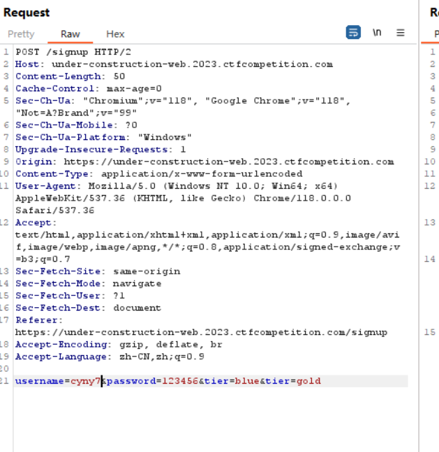

google ctf的题目的质量确实靠谱（后面可以再去做一做）

题目描述：We were building a web app but the new CEO wants it remade in php.

我是傻逼（他给了两个网站、第一个是用flask框架写的，第二个是用php写的！！！妈的怎么这都没看出来）

然后看注册的代码

```python
@authorized.route('/signup', methods=['POST'])
def signup_post():
    raw_request = request.get_data()
    username = request.form.get('username')
    password = request.form.get('password')
    tier = models.Tier(request.form.get('tier'))

    if(tier == models.Tier.GOLD):
        flash('GOLD tier only allowed for the CEO')
        return redirect(url_for('authorized.signup'))

    if(len(username) > 15 or len(username) < 4):
        flash('Username length must be between 4 and 15')
        return redirect(url_for('authorized.signup'))

    user = models.User.query.filter_by(username=username).first()

    if user:
        flash('Username address already exists')
        return redirect(url_for('authorized.signup'))

    new_user = models.User(username=username, 
        password=generate_password_hash(password, method='sha256'), tier=tier.name)

    db.session.add(new_user)
    db.session.commit()

    requests.post(f"http://{PHP_HOST}:1337/account_migrator.php", 
        headers={"token": TOKEN, "content-type": request.headers.get("content-type")}, data=raw_request)
    return redirect(url_for('authorized.login'))
```

登录的代码

```python
function insertUser($username, $password, $tier)
{
	$hash = password_hash($password, PASSWORD_BCRYPT);
	if($hash === false) {
		http_response_code(500);
		exit();
	}
	$host = getenv("DB_HOST");
	$dbname = getenv("MYSQL_DATABASE");
	$charset = "utf8";
	$port = "3306";

	$sql_username = "forge";
	$sql_password = getenv("MYSQL_PASSWORD");
	try {
		$pdo = new PDO(
			dsn: "mysql:host=$host;dbname=$dbname;charset=$charset;port=$port",
			username: $sql_username,
			password: $sql_password,
		);

		$pdo->exec("CREATE TABLE IF NOT EXISTS Users (username varchar(15) NOT NULL, password_hash varchar(60) NOT NULL, tier varchar(10) NOT NULL, PRIMARY KEY (username));");
		$stmt = $pdo->prepare("INSERT INTO Users Values(?,?,?);");
		$stmt->execute([$username, $hash, $tier]);
		echo "User inserted";
	} catch (PDOException $e) {
		throw new PDOException(
			message: $e->getMessage(),
			code: (int) $e->getCode()
		);
	}
}
```

然后获取flag的方式，这里需要tier要是gold

```php
if ($tier === "gold") {
        $response .= " " . getenv("FLAG");
    }
```

但是要设置tier为gold的话需要管理员（原本想着如何获取管理员，后来发现不需要获取管理员权限）

In Flask, the framework will read first parameter while in PHP the program will read the second parameter. 

然后后面加一个&tier=gold用来被php读取就行了

后面学到这叫参数污染

传入两个或多个相同参数但是不同值，影响服务器收到的参数值的处理

**jsp+apache接受最后一个**

**asp+iis全部接受**

**flask第一个**

**django最后一个**

这里主要是一个flask和php的区别



然后发包利用第二个网站登录即可

