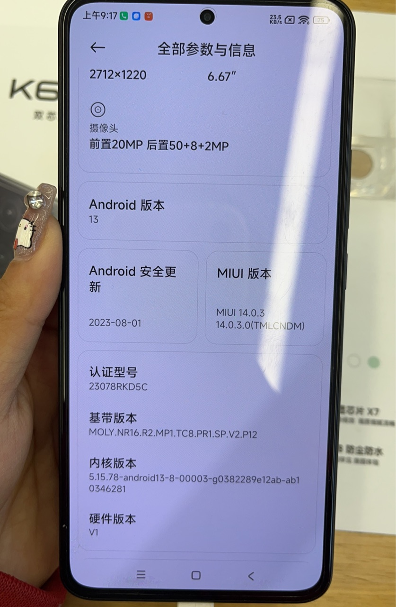
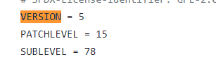
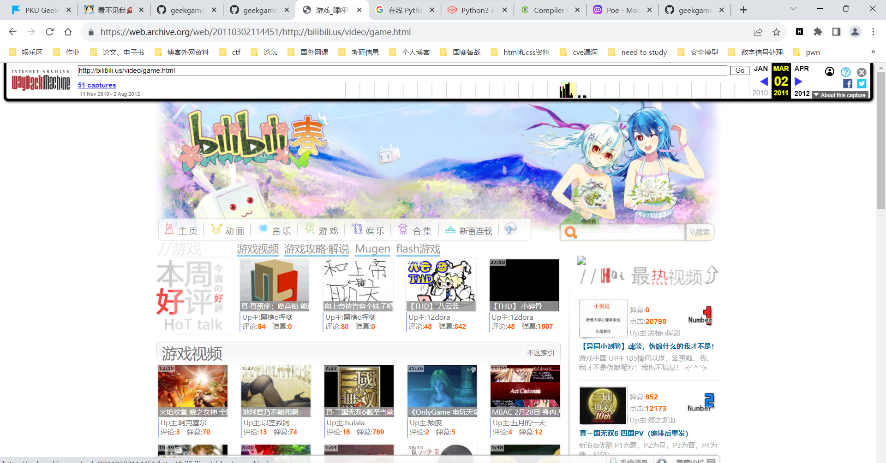
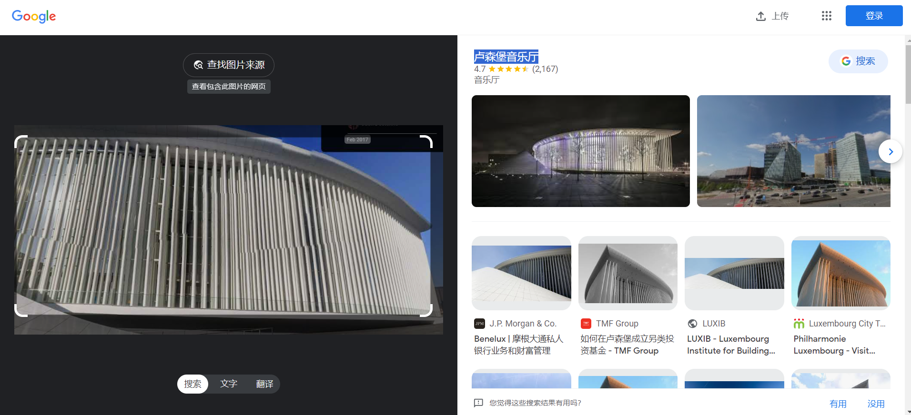

第一次做这种存信息收集的题目（感觉水平确实欠缺）

### 在北京大学（校级）高性能计算平台中，什么命令可以提交一个非交互式任务？

这个的话直接google就可以搜到答案：

sbatch

### 根据 GPL 许可证的要求，基于 Linux 二次开发的操作系统内核必须开源。例如小米公司开源了 Redmi K60 Ultra 手机的内核。其内核版本号是？

这个的话我是找一个小米店找了实机查看了版本号才知道

![(./assets/image-20231023160749147.png)

标准答案：https://github.com/MiCode/Xiaomi_Kernel_OpenSource/blob/corot-t-oss/Makefile

下面的

感觉信息收集能力还差点

**3] 每款苹果产品都有一个内部的识别名称（Identifier），例如初代 iPhone 是 `iPhone1,1`。那么 Apple Watch Series 8（蜂窝版本，41mm 尺寸）是什么？**

这个直接百度就有答案

**4] 本届 PKU GeekGame 的比赛平台会禁止选手昵称中包含某些特殊字符。截止到 2023 年 10 月 1 日，共禁止了多少个字符？（提示：本题答案与 Python 版本有关，以平台实际运行情况为准）**

在源码中找昵称部分的限制（感觉还是不够强）然后构建exp

```python
from unicategories import categories
from typing import Set
def unicode_chars(*cats: str) -> Set[str]:
    ret = set()
    for cat in cats:
        ret |= set(categories[cat].characters())
    return ret

EMOJI_CHARS = (
    {chr(0x200d)}  # zwj
    | {chr(0x200b)}  # zwsp, to break emoji componenets into independent chars
    | {chr(0x20e3)} # keycap
    | {chr(c) for c in range(0xfe00, 0xfe0f+1)} # variation selector
    | {chr(c) for c in range(0xe0020, 0xe007f+1)} # tag
    | {chr(c) for c in range(0x1f1e6, 0x1f1ff+1)} # regional indicator
)

DISALLOWED_CHARS = (
    unicode_chars('Cc', 'Cf', 'Cs', 'Mc', 'Me', 'Mn', 'Zl', 'Zp') # control and modifier chars
    | {chr(c) for c in range(0x12423, 0x12431+1)} # too long
    | {chr(0x0d78)} # too long
) - EMOJI_CHARS
print(len(DISALLOWED_CHARS))
```

然后开始找不同版本，找到一个在线编译器可以运行不同版本的

https://97b24d8a.lightly.teamcode.com/

**[5] 在 2011 年 1 月，Bilibili 游戏区下共有哪些子分区？（按网站显示顺序，以半角逗号分隔）**

最让我懵逼的一道题（甚至不知道怎么去找）

billbill之前的域名为billbill.us,然后用这个网站去找https://web.archive.org/**一个互联网资料馆网站，提供互联网上的图像，视频，音频等资料**。 我们应该最熟知的应该就是web.archive.org 这个服务了，从这里可以查询到网站的历史页面存档。

然后找billbill.us的记录



这个网站学到了

**[6] [这个照片](https://github.com/PKU-GeekGame/geekgame-3rd/blob/master/official_writeup/prob18-trivia/media/osint-challenge.jpg)中出现了一个大型建筑物，它的官方网站的域名是什么？（照片中部分信息已被有意遮挡，请注意检查答案格式）**

可以直接google识图获取结果（google识图牛逼）



拿到答案：philharmonie.lu

我主要一直被那个会议给干扰了，就一直在找那个音乐会