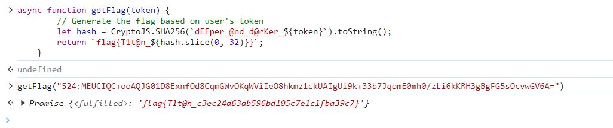

难度甚至简单到签到题？

往下翻然后比较多，就去翻网页代码了

然后看到一个main.js于是感觉有戏？于是发现了一个挺好玩的函数(感觉自己js代码的功底还是有点差)

```javascript
async function getFlag(token) {
        // Generate the flag based on user's token
        let hash = CryptoJS.SHA256(`dEEper_@nd_d@rKer_${token}`).toString();
        return `flag{T1t@n_${hash.slice(0, 32)}}`;
    }
```

然后执行这一个getaflag函数输入自己的token即可



感觉挺有意思的一道题