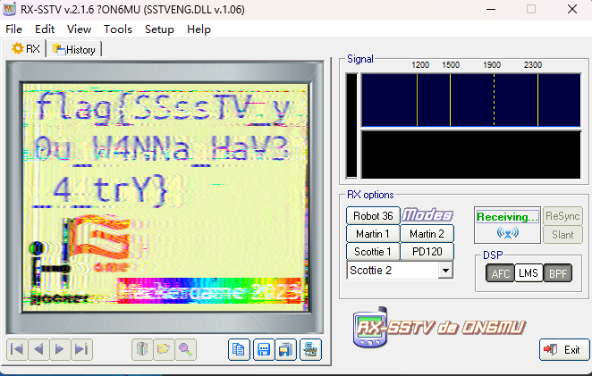

查询关键字发现音频是慢扫描电视，即SSTV，可以直接用软件解码，

**慢扫描电视**（英语：Slow-scan television），简称**SSTV**，是[业余无线电](https://zh.wikipedia.org/wiki/业余无线电)爱好者的一种主要图片传输方法，慢扫描电视通过[无线电](https://zh.wikipedia.org/wiki/无线电)传输和接收单色或彩色静态图片。

慢扫描电视的一个术语名称是窄带电视。广播电视需要6MHz的带宽，因为帧速为25到30fps[[1\]](https://zh.wikipedia.org/zh-hans/慢扫描电视#cite_note-1)。慢扫描电视的[带宽](https://zh.wikipedia.org/wiki/带宽)只有3kHz，因此慢扫描电视是一种慢得多的静态图像传输方法，通常每帧需要持续8秒或若干分钟。

然后用手机放声音即可获取flag

